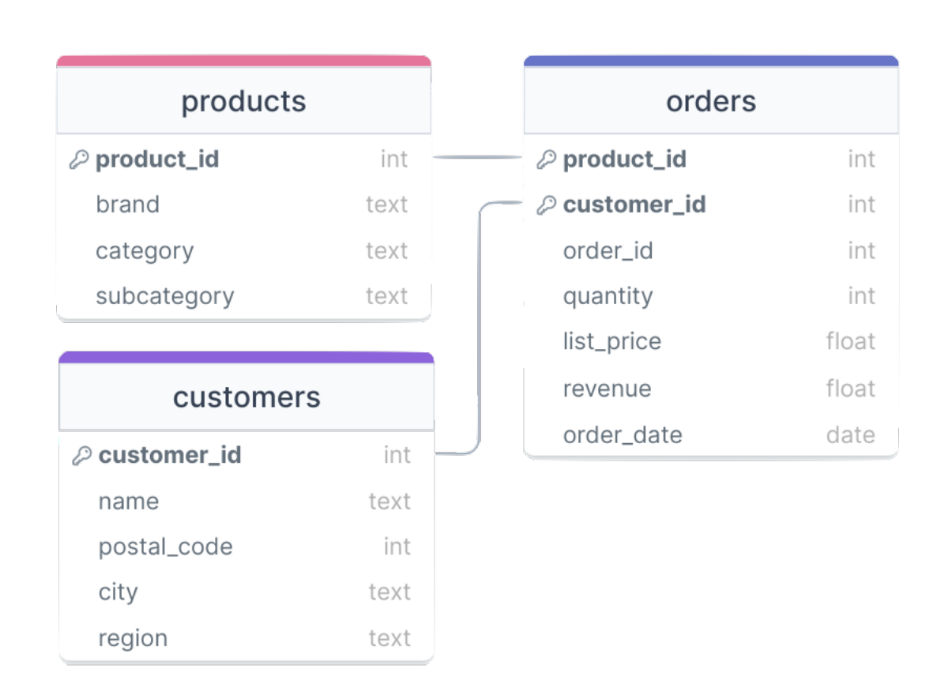

# SQL Practice (PostgreSQL)

All the exercises have been written and made withing PostgreSQL environment, with a data model based on three tables:

Basic reporting exercises:
- [x] 1. Write a SQL query to identify which categories have generated greater billing over the last 12 months.
- [x] 2. Write a SQL query to identify the x most popular y brands, having count of the total of orders made. (x: quantity, y: category)
- [x] 3. Write a SQL query to extract regions by electronic based billing. Sort by billing descending.

Client behavior exercises:
- [x] 1. Which are the products with the highest purchase average in 2022?
- [x] 2. Identify subcategories, sorting by order, in the **Beauty** category.
- [ ] 3. Write a SQL query to extract the average annual client value.