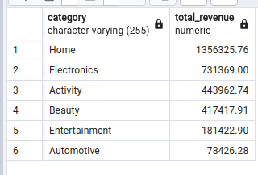
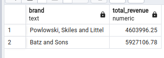
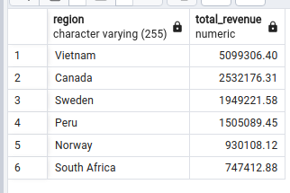
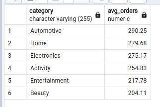
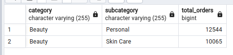
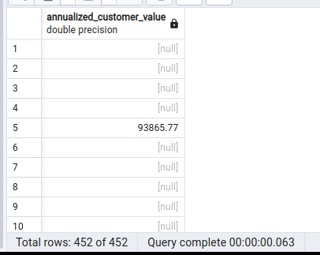

<div align='center'>
    <h2>Ejercicios SQL (PostgreSQL)<h2>
</div>

---

## **Set-Up**

Antes de comenzar con los ejercicios fue necesario construir la base de datos mediante el modelo pre-definido, para ello
es necesario escribir una query que cree todas las relaciones entre las tablas:
```sql
DROP TABLE IF EXISTS products CASCADE;
DROP TABLE IF EXISTS customers CASCADE;
DROP TABLE IF EXISTS orders CASCADE;

CREATE TABLE products(
	product_id INT GENERATED ALWAYS AS IDENTITY,
	brand TEXT,
	category VARCHAR(255),
	subcategory VARCHAR(255),
	created_at TIMESTAMPTZ DEFAULT Now(),
	PRIMARY KEY(product_id)
);

CREATE TABLE customers(
	customer_id INT GENERATED ALWAYS AS IDENTITY,
	name TEXT,
	postal_code INT,
	city VARCHAR(255),
	region VARCHAR(255),
	created_at TIMESTAMPTZ DEFAULT Now(),
	PRIMARY KEY(customer_id)
);

CREATE TABLE orders(
	order_id INT GENERATED ALWAYS AS IDENTITY,
	product_id INT,
	customer_id INT,
	quantity INT,
	list_price FLOAT,
	revenue FLOAT,
	order_date VARCHAR(255),
	created_at TIMESTAMPTZ DEFAULT Now(),
	PRIMARY KEY(order_id),
	CONSTRAINT fk_product
		FOREIGN KEY(product_id)
			REFERENCES products(product_id)
			ON DELETE SET NULL,
	CONSTRAINT fk_customer
		FOREIGN KEY(customer_id)
			REFERENCES customers(customer_id)
			ON DELETE SET NULL
);
```

Destacar que, aunque ```order_date``` es de tipo **VARCHAR**, este podria ser de tipo **DATE** haciendo un previo casteo de los datos a dicho formato.

---

## **Date Casting**

Para poder trabajar con las fechas y, por ende, poder usarlas como referencia en búsquedas, vamos a realizar un casteo de la columna:
```sql
TO_DATE(order_date, 'MM-DD-YYYY')
```

---

## **Ejercicios SQL**
1. *Escribir una query en SQL para identificar las categorías que han generado más facturación en los
últimos 12 meses.*
```sql
SELECT
	p.category,
	ROUND(SUM(o.revenue)::numeric,2) AS total_revenue
FROM products p
INNER JOIN orders o ON p.product_id = o.product_id
WHERE TO_DATE(o.order_date, 'MM-DD-YYYY') >= DATE_TRUNC('month', CURRENT_DATE) - INTERVAL '1 year'
GROUP BY p.category
ORDER BY total_revenue DESC;
```


2. *Escribir una query en SQL para identificar las 10 marcas de ropa más populares, según cantidad
total de órdenes para todos los datos de la serie.*
```sql
SELECT
	p.brand,
	ROUND(SUM(o.revenue)::numeric,2) total_revenue
FROM products p
INNER JOIN orders o ON p.product_id = o.product_id
WHERE p.category = 'Beauty'
GROUP BY p.brand
ORDER BY total_revenue ASC;
```


3. *Escribir una query en SQL para extraer regiones, según facturación en electrónica. Ordenar
resultado por facturación de forma descendente.*
```sql
SELECT
	c.region,
	ROUND(SUM(o.revenue)::numeric,2) total_revenue
FROM customers c
	INNER JOIN orders o ON c.customer_id = o.customer_id
	INNER JOIN products p ON o.product_id = p.product_id
WHERE p.category LIKE 'Electro%'
GROUP BY c.region
ORDER BY total_revenue DESC;
```


---

## **Ejercicios Comportamiento de Cliente SQL**
1. *¿Cuáles son las categorías de productos con frecuencia media de compra más alta en 2022? Interpretar frecuencia como cantidad de órdenes por usuario.*
```sql
SELECT
	p.category,
	ROUND(AVG(o.quantity),2) avg_orders
FROM products p
INNER JOIN orders o ON p.product_id = o.product_id
WHERE EXTRACT('Year' FROM TO_DATE(o.order_date, 'MM-DD-YYYY')) = '2022'
GROUP BY p.category
ORDER BY avg_orders DESC;
```


2. *Identificar subcategorías que representan puntos de entrada para clientes en categoría beauty. Interpretar punto de entrada como la subcategoría del primer producto que ha ordenado un cliente.*
```sql
SELECT
	p.category,
	p.subcategory,
	SUM(o.quantity) total_orders
FROM products p
INNER JOIN orders o ON p.product_id = o.product_id
WHERE p.category = 'Beauty'
GROUP BY p.subcategory, p.category;
```


3. *Escribir una query en SQL para extraer el valor medio anualizado del cliente. Interpretar el valor
anualizado del cliente como la media de facturación para los 12 meses anteriores a la última compra de cada cliente.*
```sql
SELECT
	CASE
		WHEN TO_DATE(o.order_date, 'MM-DD-YYYY') >= DATE_TRUNC('month', CURRENT_DATE) - INTERVAL '1 year'
		THEN SUM(o.revenue)
	END annualized_customer_value
FROM orders o
INNER JOIN customers c ON o.customer_id = c.customer_id
GROUP BY o.order_date;
```


---

## **A destacar**

- En varios ejercicios, dada la naturaleza del **Double Precission** en PostgreSQL, fue necesario castear el resultado de la operación a ```::numeric```
antes de poder realizar un redondeo sobre este.
- El cuarto ejercicio de la serie normal de SQL no pudo ser resuelto dado que no poseía el set de datos necesario.
- El tercer ejercicio del set de Comportamiento de cliente necesita revisión puesto que no pude sacar una solución acorde.
- **Todos** los sets de datos usados han sido construidos mediante generadores para poder realizar los ejercicios.